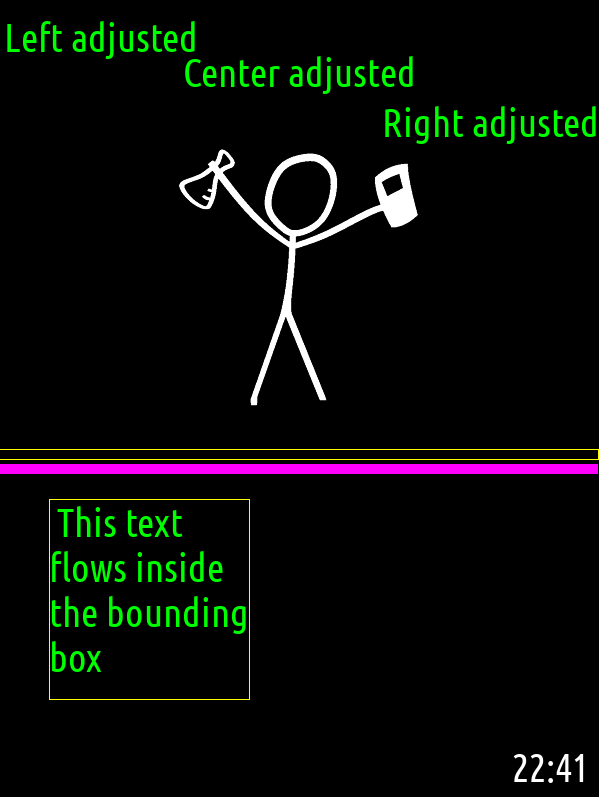
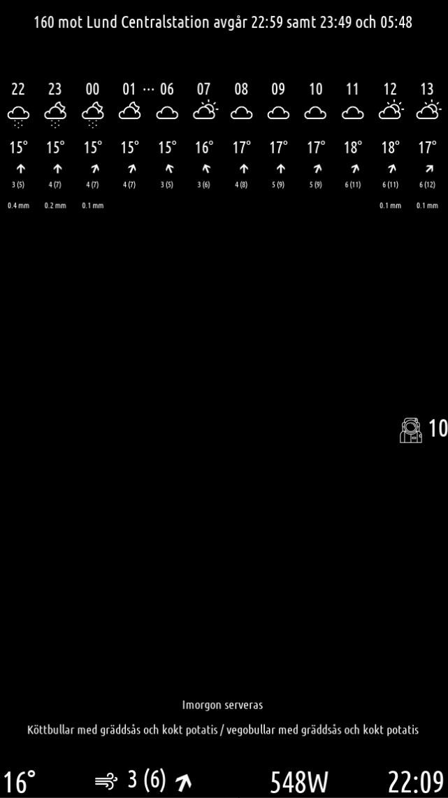
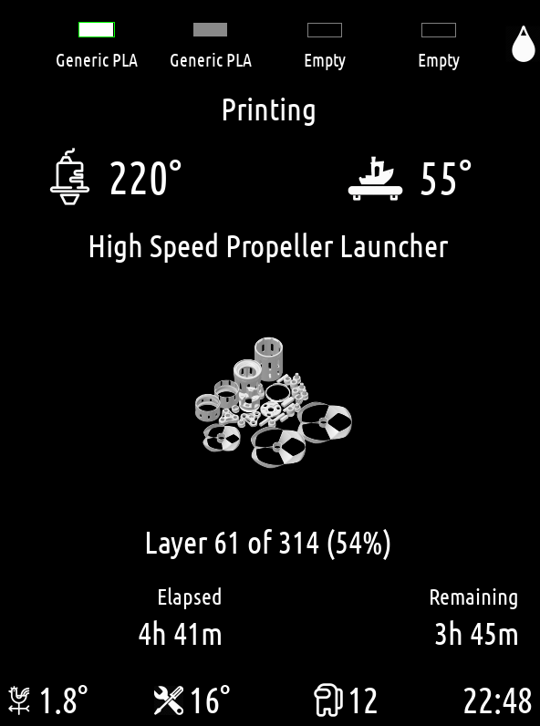

========
PyMirror
========

PyMirror is a simple Python module for creating magic mirrors or other informative displays using Python.

Let's start with a demo, assuming you have cloned this repo:

.. code-block::

   python -m venv venv && source venv/bin/activate
   pip install -e . --upgrade
   cd example
   python -m pymirror -c conf.yml -s 0.5



PyMiror is based on Pygame and uses a concept of simple modules. A configuration file lists the modules
you want to display, their location on screen and any other configuration the modules need.
Your module defines a callback that does the drawing.

This is a module for drawing a clock:

.. code-block::

   import logging
   import datetime
   import pymirror

   def init(mirror: pymirror.Mirror, config: dict) -> Optional[any]:
      logging.info(f"Hello world from the time module with config {config}")
      return {"locals": "foo"}  # Will be passed as `locals` to `draw(...)` below

   def draw(mirror: pymirror.Mirror, locals: any):
      global info
      now = datetime.datetime.now()
      str = "{now.hour:02d}:{now.minute:02d}"
      mirror.draw_text(str, info["width"], 0, adjustment = pymirror.Adjustment.Right, size = info["font_size"])

The ``init`` function is called when the module is loaded. The return value is passed as the
``locals`` parameter to ``draw(...)`` and can be used for any data you wish to pass to the
drawing function (eg. loaded images).

PyMirror has a set of functions for drawing text and images on screen. The time module demonstrates
text drawing, the pngimage module how to draw an image and the demo module other primitives.

Here are two examples, first a 27" magic mirror in my hallway showing public transportation, weather forecast,
number of people currently in space, outside temperature and wind conditions, time and the current
electrical power consumption:



Next is a 21" wall mounted display in my workshop showing the current state of my Bambulab 3D printer:



One's fantasy is the limit ;)

The configuration file specifies what is drawn and where. Here is a simple hello world display
drawing an xkcd character and the current time:

.. code-block::

   [mirrorconfig]
   name = Demo
   fullscreen = False
   screen_width = 1200
   screen_height = 1600
   scale = 0.5
   font_size = 80
   font_color = ffffff
   fps = 2

   # Cache for saving scaled images
   cache_dir = cache

   [time]
   source = modules/time.py
   top = -110
   left = -270
   width = 250
   height = 100

   [xkcd]
   source = modules/pngimage.py
   top = 300
   left = 350
   width = 500
   height = 526
   image_name = ../xkcdScience.png

At the top we have the ``mirrorconfig`` section describing the size of your mirror. There is a scaling
parameter for running the mirror in a scaled window. The ``font_size`` and ``font_color`` properties are
global for all text drawing. The ``cache_dir`` is used for storing scaled images. This directory can be
copied to your Raspberry Pi as scaling might be very very slow on eg. an RPi 1B. Next comes the module
definitions. Each module must have the properties ``source`` and the bounding rectangle of the module.
Origo is at the top left corner as usual. If ``top`` or ``left`` is negative, the value will be interpreted
as eg. ``top`` pixels from the bottom and can be used for right/bottom adjustment. For the ``pngimage`` module,
we of course also specify the image to be drawn. Note the ``fullscreen`` and ``scale`` directives, these are
useful when developing a screen in a window on a smaller screen.

Saving this configuration in ``config.yml`` we can start the mirror with the command ``python -m pyirror -c config.yml``

------------
Installation
------------

First of all, I use a rather ancient version of Buster (version 10) for my RPis (2023-05-03-raspios-buster-armhf-lite-legacy).
The reason for this is that newer versions of the Raspberry Pi OS turn off HDMI output right before the login prompt
is displayed. I have no idea why and no time to find out ;)

.. code-block::

   sudo apt update && sudo apt upgrade -y

I use Python 3.10 which is not available for that archaic Buster so I build my own

.. code-block::

   sudo apt-get install -y make build-essential libssl-dev zlib1g-dev libbz2-dev libreadline-dev libsqlite3-dev wget curl llvm libncurses5-dev libncursesw5-dev xz-utils
   wget https://www.python.org/ftp/python/3.10.0/Python-3.10.0.tar.xz
   tar -xJf Python-3.10.0.tar.xz && cd Python-3.10.0
   ./configure --enable-optimizations --with-ensurepip=install && sudo make altinstall && sudo ln -fs /usr/local/bin/python3.10 /usr/bin/python3
   sudo ln -s /usr/share/pyshared/lsb_release.py /usr/local/lib/python3.10/site-packages/lsb_release.py

Python 3.7 has now been replaced with Python 3.10 when you start ``python3``.

Next, install Pygame

.. code-block::

   sudo apt install -y libsdl2-2.0-0 libsdl2-dev libsdl2-gfx-1.0-0 libsdl2-gfx-dev libsdl2-image-2.0-0 libsdl2-image-dev libsdl2-mixer-2.0-0 libsdl2-mixer-dev libsdl2-net-2.0-0 libsdl2-net-dev libsdl2-ttf-2.0-0 libsdl2-ttf-dev
   sudo -H python3 -m pip install pygame

Try Pygame:

.. code-block::

   % python3
   >>> import pygame
   >>> pygame.display.init()
   <frozen importlib._bootstrap>:241: RuntimeWarning: Your system is neon capable but pygame was not built with support for it. The performance of some of your blits could be adversely affected. Consider enabling compile time detection with environment variables like PYGAME_DETECT_AVX2=1 if you are compiling without cross compilation.

If you find that Pygame prints lots and lots of lines about ALSA underrun, add the following to your bashrc:

.. code-block::

   export SDL_AUDIODRIVER="dsp"

or the following before ``import pygame``

.. code-block::

   import os
   os.environ["SDL_AUDIODRIVER"] = "dsp"

-------------
Auto Starting
-------------

I use supervisord for starting the screen at boot:

.. code-block::

   sudo apt install -y supervisor

Create the file ``/etc/supervisor/conf.d/pymirror.conf``:


.. code-block::

   [program:workshop-display]
   directory = /home/pi/workshop-display
   command = python3 /home/pi/workshop-display/display.py -c /home/pi/workshop-display/conf.yml
   autostart = true
   autorestart = true
   startsecs = 10
   startretries = 3
   redirect_stderr = true
   stdout_logfile = /var/log/workshop-display.log
   user = pi

Reload supervisor ``sudo supervisorctl reread && sudo supervisorctl update`` and the mirror should start at boot.

----------
What Next?
----------

I have two other repos with `various modules <https://github.com/kanflo/pymirror-modules/tree/main>`_ and a module for `displaying status <https://github.com/kanflo/pymirror-bambulab>`_ from your Bambulab 3D printer.


-----
TODOs
-----

```pymirror/ubuntu-font-family-0.83/``` is not included when pip installed, find out why.
